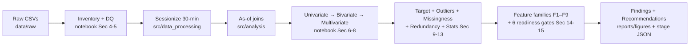

# From Clickstream to Purchase Intent: EDA of a 2.76M-Event E-commerce Log

An end-to-end exploratory data analysis that turns a three-table e-commerce interaction log — 2,756,101 events, 20,275,902 item-property records, and a 1,669-node category hierarchy (May–Sep 2015) — into a trustworthy foundation for purchase-intent modeling.

No data dictionary. No target column. No session id in the raw data. Every modeling decision below is earned from measurement: sessions are defined empirically (gap-robust at 30 minutes), a 25.5% temporal-leakage trap in naive feature joins is quantified, `session-buy` (0.81%) is selected as the primary candidate target, and the analysis closes with six binding ML-readiness gates. Associations are never presented as causes.

## Overview

**Problem:** can this clickstream support a production-grade purchase-intent / recommendation model, and what must be proven before training?

**Sub-questions:** (1) Is there learnable signal above a ~0.8% base rate? (2) Can sessions, labels, and point-in-time features be constructed without leaking the future? (3) Which features survive redundancy, sparsity, and missingness analysis?

**Answer (verdict: READY WITH CONDITIONS):** data quality passes with controls; features are approved in 9 families; the candidate target is viable at extreme imbalance with contained label risks — provided six gates hold before training (as-of pipeline, banned-feature list, temporal session-aware splits, PR-AUC + tail-slice reporting, explicit unknown states, rank/log transforms). **No model is trained in this repo by design** — training on unexamined joins would have leaked (25.5%) and optimized a vanity metric.

## Key Features

- Reproducible EDA in `notebooks/01_exploratory_data_analysis.ipynb` (36 cells, Sec 1–18), with reusable logic in `src/`
- Leakage-safe sessionization (`sessionize_events`, 15/30/60-min sensitivity) and point-in-time joins (`as_of_item_attributes` via backward `merge_asof`)
- Quantified leakage audit: naive latest-value join vs. as-of state (`as_of_vs_naive_disagreement`)
- Funnel, availability, category (Empirical-Bayes smoothed), concentration, and coverage analytics with Wilson intervals and Cramér's V
- 18 committed figures, each answering one ranked analytical question (Q1–Q10)
- Measurement artifacts in `reports/stage*.json/csv` so sections render without re-running the full pipeline
- 16 unit tests on synthetic data (`pytest -q` → 16 passed, no large data needed)

## Architecture



## Tech Stack

| Technology | Purpose |
| ---------- | ------- |
| Python | Core analysis language |
| pandas | Chunked scans, sessionization, `merge_asof` point-in-time joins, crosstabs |
| NumPy | Ranked vectors, decile/concentration math |
| Matplotlib | All 18 report figures (`src/visualization.py` single style source) |
| SciPy | Reference backend for Sec-13 methods (chi-square, rank tests); statistics additionally verified on stdlib distributions |
| Jupyter | `notebooks/01_exploratory_data_analysis.ipynb` |
| pytest | 16 unit tests on synthetic data |
| Parquet | Regenerable derivatives in `data/processed/` |

No scikit-learn, no seaborn — nothing in this EDA needs them (`requirements.txt` states this explicitly; modeling belongs to a next stage).

## Project Structure

```text
.
├── data/
│   ├── README.md                          # provenance + layout
│   ├── raw/                               # immutable source CSVs (local; git-ignored, ~1 GB)
│   │   ├── events.csv                     # 2,756,101 rows
│   │   ├── category_tree.csv              # 1,669 rows
│   │   ├── item_properties_part1.csv      # 10,999,999 rows (EAV)
│   │   └── item_properties_part2.csv      # 9,275,903 rows (EAV)
│   └── processed/                         # regenerable derivatives (git-ignored)
│       ├── .gitkeep
│       ├── events_session30.parquet       # events + 30-min session_id
│       ├── prop_available.parquet         # 1,503,639 availability timeline rows
│       └── prop_categoryid.parquet        # 788,214 categoryid timeline rows
├── notebooks/
│   └── 01_exploratory_data_analysis.ipynb # 36 cells, Sec 1–18, all measured
├── src/
│   ├── __init__.py
│   ├── data_processing.py                 # sessionize_events, to_utc_datetime,
│   │                                      # list_raw_files, summarize_duplicates
│   ├── analysis.py                        # funnel_rates, session_sensitivity,
│   │                                      # as_of_item_attributes,
│   │                                      # as_of_vs_naive_disagreement,
│   │                                      # availability_at_event_time,
│   │                                      # category_conversion,
│   │                                      # concentration_curve, property_coverage,
│   │                                      # wilson_interval, cramers_v_from_chi2
│   └── visualization.py                   # apply_report_style,
│                                          # save_figure → reports/figures/
├── reports/
│   ├── stage4_events_cat.json
│   ├── stage4_prop_top.csv
│   ├── stage4_univariate.json
│   ├── stage4_weekly.csv
│   ├── stage5_asof.json
│   ├── stage5_avail_pop.json
│   ├── stage5_corr_items.csv
│   ├── stage5_deciles.csv
│   ├── stage5_funnel.json
│   ├── stage5_multi.json
│   ├── stage5_roots.csv
│   ├── stage5_sessions.json
│   ├── stage5_sesslen.json
│   ├── stage5_weekly_tx.csv
│   ├── stage6_corr_pearson.csv
│   ├── stage6_gaps_extra.json
│   ├── stage6_missing.json
│   ├── stage6_outliers.json
│   ├── stage6_stats.json
│   └── figures/                           # 18 Q-linked charts (committed PNGs)
│       ├── fig_asof_available.png
│       ├── fig_asof_unknown_week.png
│       ├── fig_avail_pop.png
│       ├── fig_category_conversion.png
│       ├── fig_concentration.png
│       ├── fig_corr_items.png
│       ├── fig_event_mix.png
│       ├── fig_funnel.png
│       ├── fig_gap_hist.png
│       ├── fig_outlier_triage.png
│       ├── fig_pearson_spearman_delta.png
│       ├── fig_popularity_conversion.png
│       ├── fig_property_coverage.png
│       ├── fig_session_length_outcome.png
│       ├── fig_session_sensitivity.png
│       ├── fig_value_length.png
│       ├── fig_weekly_txrate.png
│       └── fig_weekly_volume.png
├── tests/
│   └── test_data_processing.py            # 16 tests, synthetic data only
├── prompts/                               # staged build prompts (process notes)
│   ├── prompt-1.md
│   ├── prompt-2.md
│   ├── chunk-1.md
│   ├── chunk-2.md
│   ├── chunk-3.md
│   ├── chunk-4.md
│   ├── chunk-5.md
│   ├── chunk-6.md
│   ├── chunk-7.md
│   └── chunk-8.md
├── requirements.txt
├── .gitignore
├── LICENSE                                # MIT
├── CODE_OF_CONDUCT.md
├── CONTRIBUTING.md
└── SECURITY.md
```

> Omits machine-generated directories (`.git/`, `__pycache__/`, `.pytest_cache/`).

## Dataset

Three linked tables in `data/raw/` (local only, ~1 GB total — git-ignored per `.gitignore`; see `data/README.md`):

| File | Rows | Schema |
| ---- | ---- | ------ |
| `events.csv` | 2,756,101 × 5 | `timestamp` (epoch ms), `visitorid`, `event` (view / addtocart / transaction), `itemid`, `transactionid` (present iff transaction) |
| `item_properties_part1.csv` + `part2.csv` | 20,275,902 × 4 combined | EAV long format: `timestamp, itemid, property, value` (~1,104 opaque codes; only `available` and `categoryid` are face-interpretable) |
| `category_tree.csv` | 1,669 × 2 | `categoryid, parentid` (25 roots) |

Coverage facts: 1,407,580 visitors; 235,061 interacted items vs. 417,053 catalogued items (21% of interacted items have no property rows at all). Events span 2015-05-03 to 2015-09-18. No data dictionary was found in the repo. Schema matches the public RetailRocket recommender dataset as a working hypothesis only — unconfirmed, do not cite as fact.

Derivatives in `data/processed/` (regenerable, git-ignored): `events_session30.parquet`, `prop_available.parquet` (1,503,639 `available` timeline rows), `prop_categoryid.parquet` (788,214 `categoryid` timeline rows).

To obtain the data, place the source CSVs in `data/raw/` as described in `data/README.md`. They are not committed to git.

## Methodology

Staged EDA (inventory → objective → questions → univariate → bivariate/multivariate/target → outliers/missingness/relationships/stats/FE → readiness/findings/recommendations). Large-table work uses chunked scans; point-in-time joins use `merge_asof`. Statistics are pre-registered (4 tests, Bonferroni α = 0.0125, effect sizes lead).

### Data Cleaning

Documented, nothing silently cleaned: `transactionid` 99.19% missing is structural (present ⟺ transaction, 0 violations) — grouping key only, banned as a feature. 460 exact-duplicate `addtocart` rows (double-logging pattern) quarantined with with/without sensitivity policy; 3 `visitorid=0` rows quarantined from user-level features. Type traps contained: float `transactionid`/`parentid`, mixed-format `value` (bare/multi-token/`n`-numeric/binary), epoch-ms timestamps. No invalid numerics, no impossible dates, exactly 3 consistent event spellings.

### Exploratory Data Analysis

Ten ranked questions (Q1–Q10, P0/P1/P2) each answered by a named section: funnel/learnability, sessionization, as-of join validity, availability, category hierarchy, head-vs-tail concentration, duplicates/`visitorid=0`, property encodability, price-like numerics, basket viability/missingness bias.

### Feature Engineering

Proposals only — no pipeline built. Nine approved families (F1–F9); `item-visitors` dropped (ρ = 0.98 redundant). Key transforms pre-registered: explicit `unknown` states (never imputation), rank/log representations (never deletion of genuine extremes like 31-SKU baskets or power shoppers).

### Model Development

No model trained by design. The deliverable is the validated framing: `session-buy` @ 0.81% with prefix-legal features only (total session length banned as post-hoc leakage). Prescribed next step: temporal session-aware splits (temporal holdout of last weeks, session-aware grouping, rolling-origin CV — never shuffled K-fold), gradient-boosting + popularity back-off baseline, PR-AUC with recall@precision operating points and head/tail/cold-start slices.

### Evaluation

Accuracy banned (0.8% base rate). Required: PR-AUC + tail-slice reporting. Reported with Wilson 95% intervals and effect sizes (Cramér's V, rank-biserial); Pearson-vs-Spearman deltas shown to justify rank methods (Pearson overstates every link, up to +0.21).

## Results

All numbers measured from the data (`reports/stage*.json`):

| Grain | Buy rate | Source |
| ----- | -------: | ------ |
| Event (`transaction` / all events) | 0.815% (22,457 / 2,756,101; 8.43 tx / 1,000 views) | `stage5_funnel.json` |
| Session-buy (30-min gap, 1,761,675 sessions) | 0.812% (14,297 buy sessions; 27.17% of cart sessions convert) | `stage5_funnel.json` |
| Visitor-buyer | 0.833% (11,719 / 1,407,580) | `stage5_funnel.json` |

Key measured effects (associational, not causal):

| Effect | Measurement |
| ------ | ----------- |
| In-stock vs. out-of-stock conversion | 1.36% vs. 0.15% (~9×; Δ CI [1.13, 1.29] pp, z = 25.1); survives popularity split |
| Naive vs. as-of join disagreement | 25.51% of jointly-covered rows (200k sample; as-of coverage 80.81%, naive 90.76%) |
| Head vs. tail | Monotonic deciles 0.7 → 10.3 tx/1,000 views; converting items median 38 views vs. 3 (rank-biserial 0.84) |
| Category branch | 45× smoothed root spread, yet Cramér's V = 0.029 → back-off signal, not discrimination |
| Session-gap sensitivity (15/30/60 min) | 1,809,161 / 1,761,675 / 1,726,714 sessions; single-event share 79.08 / 78.27 / 77.64% |
| As-of unknown over time | Views carry ~2× the unknown rate of carts; 100% → 10% across weeks (feed warm-up) |
| Weekly stationarity | 7–10 tx/1,000 views per week; wobble significant (p ≈ 1e-17) but practically ±15% |

## Installation

```bash
git clone <repository-url>
cd CodeAlpha-Exploratory-Data-Analysis-EDA
python -m venv .venv

# Windows
.venv\Scripts\activate

# macOS/Linux
source .venv/bin/activate

pip install -r requirements.txt
```

Requires Python with pip; `requirements.txt` pins `pandas>=2.0, numpy>=1.24, matplotlib>=3.7, scipy>=1.10, jupyter>=1.0, pytest>=7.0`.

## Usage

```bash
pytest -q                                   # 16 unit tests, no large data needed
# place source CSVs in data/raw/ (see data/README.md), then:
jupyter notebook notebooks/01_exploratory_data_analysis.ipynb
```

The notebook's setup cell inventories `data/raw/`; heavy EAV scans are chunked and section code cells render from committed `reports/stage*.json` artifacts, so review is possible without re-running the full pipeline.

## Testing

- Framework: `pytest`, single file `tests/test_data_processing.py`, synthetic data only (no raw CSVs required).
- Coverage: sessionization splits, as-of join never uses future state, naive-vs-as-of disagreement detection, funnel math, Wilson interval containment, Cramér's V bounds, category smoothing, property coverage, duplicate policy, timestamp conversion, raw-file inventory.
- Run: `pytest -q` → `16 passed`.

## Reproducibility

- Constants named in `src/data_processing.py` (`RANDOM_STATE = 42`, `SESSION_GAP_MINUTES_CANDIDATES = (15, 30, 60)`, epoch-ms unit explicit).
- Measurement artifacts committed (`reports/stage*.json/csv`); figures committed (`reports/figures/`, 18 PNGs).
- Raw data layout documented in `data/README.md`; processed Parquet regenerable via the notebook/stage pattern.
- To reproduce: install deps → place CSVs in `data/raw/` → run tests → execute notebook top-to-bottom.

## Limitations

- No data dictionary: ~1,104 property codes opaque; only `available`/`categoryid` interpretable. Top semantic risk.
- Extreme imbalance (~0.8% buy rate) with contained but real label risks; accuracy unusable.
- 25.5% leakage under naive joins — any future pipeline must be as-of.
- 21% of interacted items lack property rows; week-1 feed warm-up (100% → 10% unknown) needs a cutoff.
- Category mapping for conversion uses latest-known (association-only caveat).
- No model, no API, no deployment in this repo; monitoring (duplicate bursts, marathon sessions, warm-up regressions) not implemented.

## Future Improvements

1. Decode/acquire the property dictionary (unlocks price/text features behind opaque codes).
2. Implement the six readiness gates as pipeline assertions; train a session-buy baseline (gradient boosting + popularity back-off) with PR-AUC/tail reporting.
3. Prefix-legal sequence modeling (session RNN/Transformer) once the baseline is beaten.
4. DVC/LFS versioning for `data/raw` + `data/processed`.
5. Upstream monitoring: duplicate bursts, marathon sessions, warm-up regressions.

## License

MIT — see [LICENSE](LICENSE).
